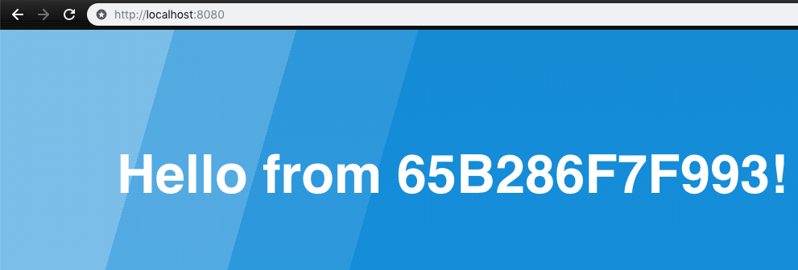

# What is it

Docker sample app using ASP.NET 4.7 and Windows Server 1803 containers. Shows container hostname on webpage. This is a simple fork of [this hostname app](https://github.com/sixeyed/presentations/tree/master/docker-webinars/windows-101-to-mta/part-1/hostname-app).

# Build the Docker image

**NOTE**: Pre-built images available on Docker Hub: https://hub.docker.com/r/derrickdocker/hostname-app/.

```PS C:\> git clone https://github.com/millerdz/hostname-app
PS C:\> cd hostname-app
PS C:\> docker image build -t my-asp-site .
```

# Run the Docker image

```PS C:\> docker run -d -p 8080:80 my-asp-site```

# View the webpage

Open your browser and go to http://localhost:8080


